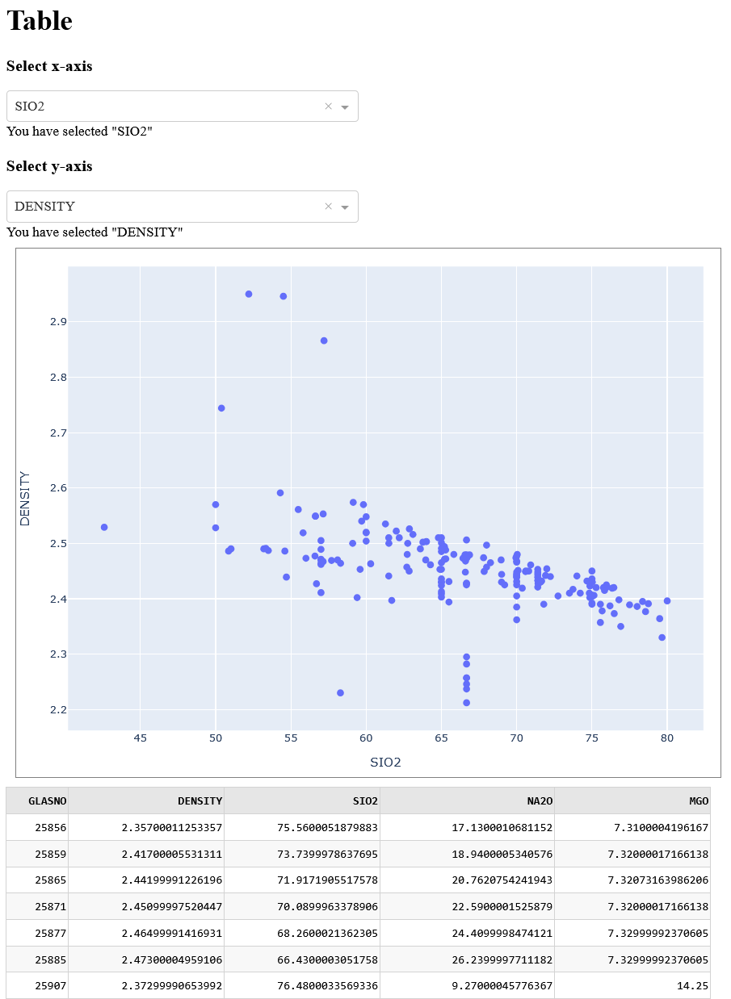
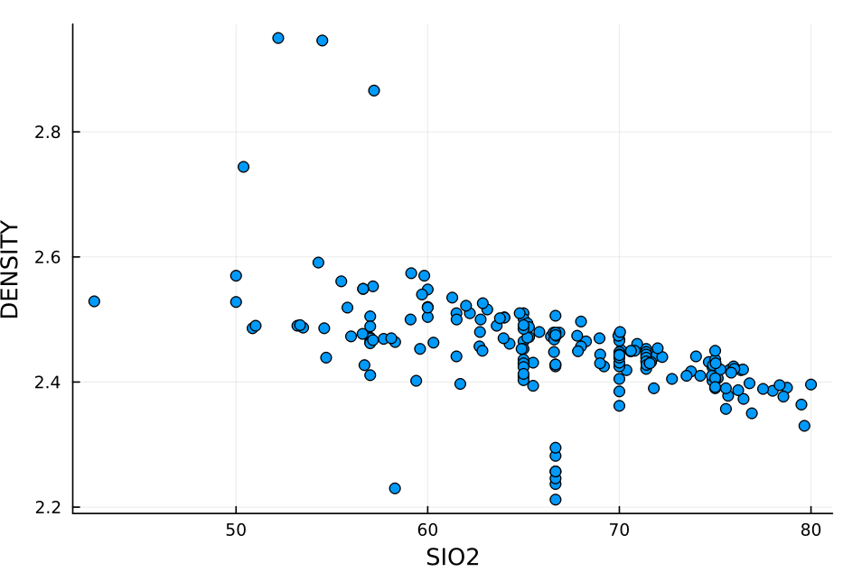
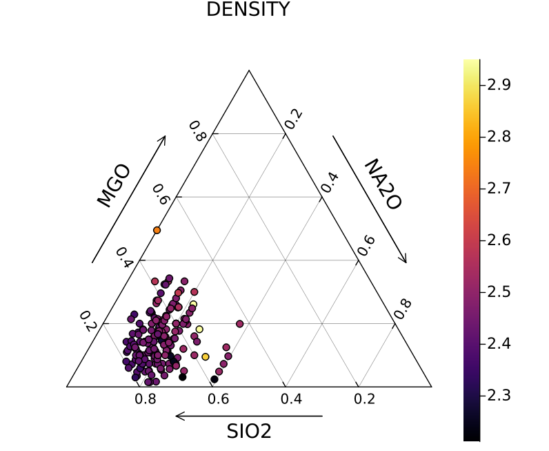
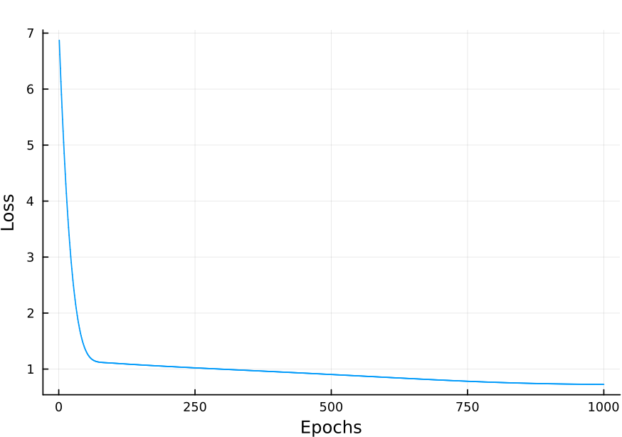

# Examples

## Example 1: Exploring Glass Properties with SciGlassDatabase in Julia

This example will guide you through using the `SciGlassDatabase` package in Julia to retrieve, visualize, and explore property data for glass compositions.
**Prerequisites:**

* **Julia Installation:** Ensure you have Julia installed on your system. You can download it from the official Julia website ([https://julialang.org/downloads/](https://julialang.org/downloads/)).
* **Pkg Package:** Julia's built-in package manager (`Pkg`) should be available.
* **SciGlassDatabase Package:** You need to install the `SciGlassDatabase` package. Open your Julia REPL (the interactive command-line interface) and run the following commands:

```julia
using Pkg
Pkg.add(url="https://github.com/ravinderbhattoo/SciGlassDatabase.git")

# You might also need a plotting package for visualization and other packages
Pkg.add("Plots")
```

**Step 1: Setting up the Environment and Loading the Package**

1.  **Load the SciGlassDatabase Package:** In your Julia REPL or script, load the `SciGlassDatabase` package:

```julia
using SciGlassDatabase
```

2.  **Load Essential Data:** Some packages might require an initial setup step. The `SciGlassDatabase` package in your example uses `load_essentials()` for loading data tables from SciGlass dataset:

```julia
load_essentials()
```

Run this command to ensure the necessary data structures or connections are initialized. For first time, it will download artifacts from github and require internet connection. Note that not all tables are loaded which can be done using [`load_all_tables!`](@ref).

**Step 2: Specifying the Glass Composition System**

1.  Define the components of the glass system you are interested in. In this example, it's a ternary system of Silicon Dioxide (SiO2), Sodium Oxide (Na2O), and Magnesium Oxide (MgO):

```julia
comps = "SiO2-Na2O-MgO"
```

The components are specified as a hyphen-separated string.

**Step 3: Retrieving Composition Data for a Specific Property**

1.  Use the [`get_compositions`](@ref) function to retrieve data. Here, we are fetching data for the "Density" property for the specified `comps` glass:

```julia
df = get_compositions(;property=["Density"], composition=comps)
```

* `property=["Density"]` tells the function to retrieve data related to the "Density" property. You can provide a list of properties if you want to retrieve data for multiple properties (e.g., `property=["Density", "Viscosity"]`).
* `composition=comps` specifies the glass system we are interested in.
* The result is stored in a variable named `df`. This variable will hold a `DataFrame` object, which is a tabular data structure commonly used in Julia for data manipulation and analysis.

**Step 4: Displaying the Retrieved Data as a Table**

1.  To get a quick look at the retrieved data, you can use the `show_table()` function:

```julia
show_table(df)
```

This will display the contents of the `df` DataFrame in a readable table format and utilizes **Dash** to show the table (follow the link shown on terminal), showing the compositions (as mol percentages of each component) and their corresponding Density values.

```julia
show_table(df; with_plot=true)
```

If keyword argument "with_plot" is true, it will show table with plot capabilities.




**Step 5: Creating a Scatter Plot of Property vs. Composition**

1.  The [`scatterplot_table`](@ref) function allows you to visualize the relationship between a specific component's proportion and a property. Here, we plot the mole percentage of SiO2 against the Density:

```julia
scatterplot_table(df, :SIO2, :DENSITY)
```

* `:SIO2` and `:DENSITY` are symbols representing the column names in your `df` DataFrame. Make sure these column names exist in your retrieved data. This command will generate a scatter plot where the x-axis represents the amount of SiO2 and the y-axis represents the Density. You might need to have a plotting backend loaded (like `Plots` with `pyplot()` or `gr()`) for the plot to be displayed.




**Step 6: Generating a Ternary Plot for Three-Component Glasses**

1.  For visualizing properties in a three-component system, you can use the [`scatterTernary`](@ref) function:

```julia
scatterTernary(comps; property="DENSITY")
```

* `comps` again specifies the three components of the system.
* `property="DENSITY"` indicates that the Density values should be visualized on the ternary diagram. The plot will show points representing different compositions within the SiO2-Na2O-MgO system, and the color of these points will correspond to the Density values.



**Step 7: Retrieving Data with Metadata**

1.  To get additional information (metadata) associated with the data points, you can use the `with_metadata=true` keyword argument in the [`get_compositions`](@ref) function:

```julia
df = get_compositions(;property=["Density"], composition=comps, with_metadata=true)
```

The `df` DataFrame will now include extra columns containing metadata, such as the source of the data (e.g., publication details), experimental conditions, or other relevant information available in the SciGlass database. You can then explore this metadata using standard DataFrame operations.


## Example 2: Predicting Glass Density using Machine Learning with Flux package

This example demonstrates how to use the data retrieved from the `SciGlassDatabase` to train a simple neural network using the `Flux.jl` machine learning library in Julia. We will predict the density of SiO2-Na2O-MgO glasses based on their composition.

**Prerequisites:**

* **Completion of Example 1:** Ensure you have successfully installed and loaded the `SciGlassDatabase` package and its dependencies as outlined in Example 1.
* **Flux.jl:** Install the `Flux.jl` package for machine learning:

```julia
using Pkg
Pkg.add("Flux")
```

* **Plots.jl:** Ensure you have a plotting backend installed (as mentioned in Example 1) as we will visualize the loss during training. If you haven't already:

```julia
using Pkg
Pkg.add("Plots")
```

* **Statistics.jl:** This is a base Julia package but we explicitly load it for the `mean` and `std` functions.

**Step 1: Load Necessary Packages and Retrieve Data**

1.  Load the required packages:

```julia
using SciGlassDatabase
using Flux
using Flux: train!
using Plots
using Statistics
```

2.  Load essential data from `SciGlassDatabase`:

```julia
load_essentials()
```

3.  Specify the glass composition system and retrieve the density data:

```julia
comps = "SiO2-Na2O-MgO"
df = get_compositions(;property=["Density"], composition=comps)
```

**Step 2: Prepare Data for Machine Learning**

1.  Extract the density values (our target variable, `y`) and the composition features (our input features, `x`). We convert them to `Float32` for compatibility with Flux and reshape them into column vectors:

```julia
y = Float32.(df.DENSITY')
x = Float32.(hcat(df.SIO2, df.NA2O, df.MGO)')
```

* `df.DENSITY'` transposes the 'DENSITY' column into a row vector.
* `hcat(df.SIO2, df.NA2O, df.MGO)` horizontally concatenates the 'SIO2', 'NA2O', and 'MGO' columns into a matrix where each row represents a glass composition. The transpose `'` then makes each composition a column vector, which is the expected input format for our model.

2.  **Normalize the data:** Normalizing the input features and the target variable can often improve the training process and the model's performance:

```julia
normalize(x) = (x .- mean(x)) ./ std(x)

x = normalize(x)
y = normalize(y)
```

The `normalize` function subtracts the mean and divides by the standard deviation for each feature and the target variable.

**Step 3: Define the Neural Network Model**

1.  We define a simple feedforward neural network using `Flux.Chain`:

```julia
model = Chain(
    Dense(3, 10),  # Input layer with 3 features (SiO2, Na2O, MgO) to 10 neurons
    Dense(10, 10), # Hidden layer with 10 neurons to 10 neurons
    Dense(10, 1)   # Output layer with 10 neurons to 1 output (predicted density)
)
```

This model has three dense layers: an input layer, one hidden layer, and an output layer.

2.  Get the parameters of the model using `Flux.params()`:

```julia
ps = Flux.params(model)
```

**Step 4: Define the Loss Function**

1.  We use the Mean Squared Error (MSE) as our loss function, which measures the average squared difference between the model's predictions and the actual density values:

```julia
loss(model, x, y) = Flux.Losses.mse(model(x), y)
```

**Step 5: Choose an Optimizer**

1.  We select the Adam optimizer, a common and effective optimization algorithm:

```julia
opt = Adam()
opt_state = Flux.setup(opt, model)
```

`Flux.setup(opt, model)` initializes the optimizer's state based on the model's parameters.

**Step 6: Train the Model**

1.  Compute the initial loss before training:

```julia
loss_0 = loss(model, x, y)
println("Initial loss: $loss_0")
```

2.  Prepare the training data as an array of tuples `(x, y)`:

```julia
data = [(x, y)]
```

3.  Set the number of training epochs:

```julia
n_epochs = 1000
```

4.  Initialize an array to store the loss values at each epoch for visualization:

```julia
loss_values = zeros(n_epochs)
```

5.  Train the model for the specified number of epochs:

```julia
for epoch in 1:n_epochs
    train!(loss, model, data, opt_state)
    loss_values[epoch] = loss(model, x, y)
    if epoch % 10 == 0
        println("Epoch: $epoch, loss: ", loss_values[epoch])
    end
end
```

* The `train!` function performs one optimization step using the provided loss function, model parameters, data, and optimizer state.
* We record the loss at each epoch and print the loss every 10 epochs to monitor the training progress.

**Step 7: Visualize the Training Loss**

1.  Plot the loss values over the epochs to see how the model is learning:

```julia
Plots.plot(loss_values, label=nothing)
xlabel!("Epochs")
ylabel!("Loss")
```

This plot should show a decreasing trend in the loss as the model learns to predict the density more accurately.



This example provides a basic introduction to using machine learning with data from the `SciGlassDatabase`. By building upon this foundation, you can explore more complex models and analyses to gain deeper insights into the relationships between glass composition and properties.


## **Further Exploration:**

These examples covered the basics of retrieving and visualizing data using `SciGlassDatabase`. You can further explore the package's capabilities by:

* **Querying for different properties:** Experiment with different property names in the `property` argument of [`get_compositions`](@ref).
* **Exploring different composition systems:** Change the `comps` variable to investigate other glass systems.
* **Using different visualization functions:** The `SciGlassDatabase` package or related visualization packages might offer other types of plots and data exploration tools.
* **Filtering and analyzing the DataFrame:** Use the functionalities of the `DataFrames.jl` package to filter, sort, and analyze the retrieved data.

