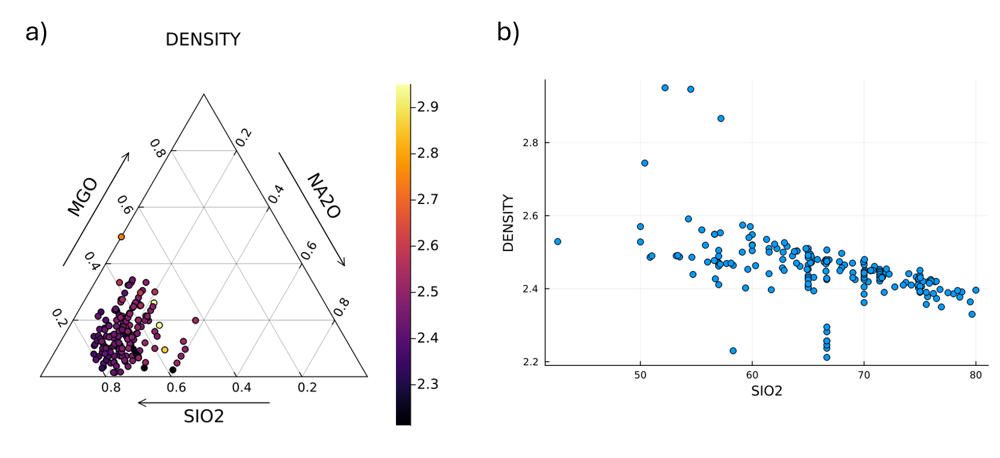

# Summary

SciGlassDatabase.jl is a Julia package designed to extract glass compositions from the SciGlass database [@EPAM]. SciGlass is a curated repository containing over 400,000 glass compositions sourced from the scientific literature. The SciGlassDatabase.jl loads the SciGlass database tables as Julia DataFrames[@dataframes], enabling further processing and analysis. Each table is stored as a CSV file and hosted as a GitHub artifact, which is automatically downloaded (once) as needed. To maintain familiarity, the table names are preserved in accordance with those used in the original SciGlass database. The package provides a set of functions for extracting specific glass compositions, associated metadata, glass properties (e.g. density, refractive index, liquidus temperature etc.), and includes tools for data analysis and visualization through tables and plots. The extracted data can be seamlessly merged with user datasets and used for various tasks, including machine learning and data-driven modeling.

# Statement of need

The SciGlassDatabase.jl package addresses a critical need for researcher scholars and professionals in the glass science and glass industry by providing an efficient and user-friendly tool to access and analyze the extensive SciGlass database. Glass researchers often require detailed compositional and property data to study structure-property relationships, develop new glass formulations, and validate theoretical models. Similarly, professionals in the glass industry rely on accurate data to optimize manufacturing processes, improve product performance, and innovate in areas such as optical, structural, and functional glass materials. While the SciGlass database itself is a rich repository of over 400,000 glass compositions, its utility is limited without a dedicated tool to streamline data extraction and analysis.

By offering a streamlined interface to extract and manipulate data from the SciGlass database, this package eliminates the need for manual data handling, saving significant time and effort. The ability to load data as Julia DataFrames enables seamless integration with Julia's powerful data analysis and visualization ecosystem (e.g. Plots.jl[@breloff_plotsjl_2025], Dash.jl[@dash] etc.). Furthermore, the package's compatibility with machine learning (e.g. Flux.jl[@Flux_2018],[@innes_2018], MLJ.jl[@Blaom2020],[@blaom2020flexible]) workflows empowers users to leverage data-driven approaches for predictive modeling and optimization tasks. This makes SciGlassDatabase.jl a useful tool for advancing research and innovation in glass science and industry.

**Existing tools**: There exist other software tools which provide access to the SciGlass database, but they are either limited in functionality or do not fully leverage the capabilities of the analysis and modeling. For instance, the SciGlass Next[@chen_ontologybased_2025] can be accessed through a web interface, but this approach lacks the flexibility and power of a dedicated package like SciGlassDatabase.jl. The web interface may not support advanced data manipulation or integration with machine learning workflows, which are essential for modern research and industrial applications. Glasspy[@cassar_glassnet_2023] is another python package which provide SciGlass database access. This package load the SciGlass database in pandas dataframes which is a powerful data manipulation library in Python but do not provide popular plot (e.g. ternary plot \autoref{figure1}) out of the box.

Overall, SciGlassDatabase.jl, is designed to be a comprehensive solution for extracting, analyzing, and visualizing data from the SciGlass database. It provides a user-friendly interface for accessing the data, along with built-in functions for data analysis and visualization. This makes it easier for researchers and professionals to work with the data and gain insights into glass compositions and properties.

# Acknowledgements
We acknowledge the support from the Indian Institute of Technology Indore for providing computational resources. We also appreciate the generosity of the SciGlass database owner for making it publicly available ([https://github.com/epam/SciGlass](https://github.com/epam/SciGlass)).

# References